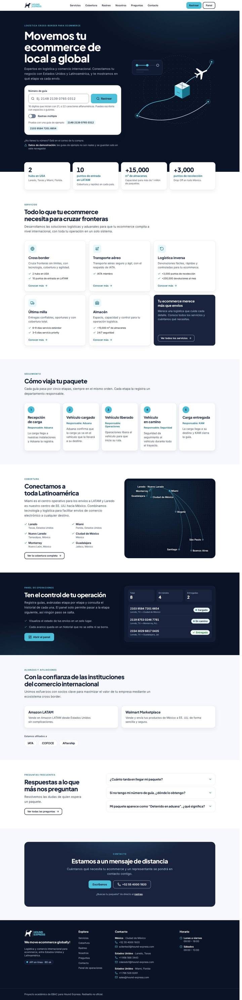
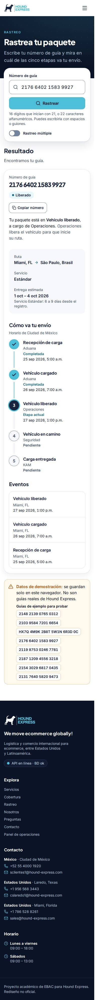
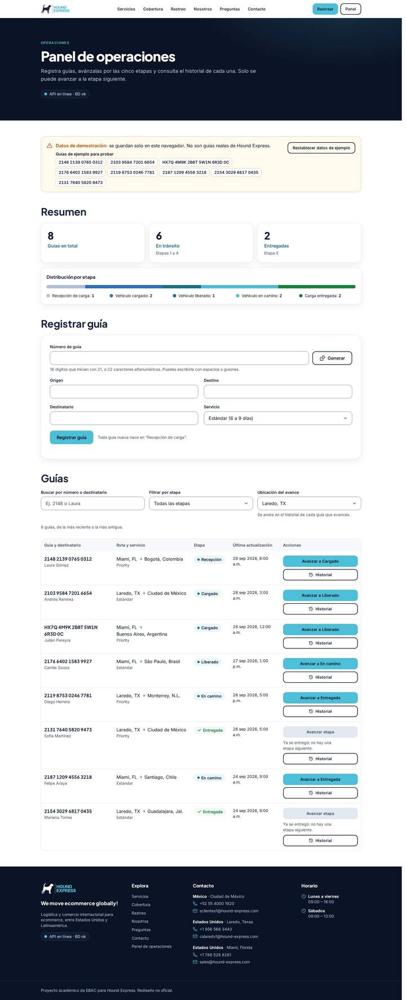

# Índice de diseños

Todas las pantallas del rediseño, capturadas con Chromium (Playwright) desde la compilación de producción (`vite preview`) con el backend encendido, en 390 px (móvil) y 1440 px (escritorio, reducida a la mitad para el repositorio). La versión viva de este índice, con paleta y componentes, es la ruta [`/disenos`](../../frontend/src/pages/Designs.tsx) de la aplicación.

En la misma pasada se midió cada pantalla en los dos anchos: sin desplazamiento horizontal, un solo `h1` y cero errores en consola.

| Pantalla | Ruta | Qué muestra | Móvil | Escritorio |
|---|---|---|---|---|
| Inicio | `/` | Héroe con buscador de guía, cifras, servicios, las cinco etapas, cobertura, panel, alianzas, preguntas y contacto. | [ver](capturas/inicio-movil.jpg) | [ver](capturas/inicio-escritorio.jpg) |
| Rastreo | `/rastreo` | Buscador simple o múltiple y guías de ejemplo para probar. | [ver](capturas/rastreo-movil.jpg) | [ver](capturas/rastreo-escritorio.jpg) |
| Rastreo con resultado | `/rastreo?guia=2176640215839927` | Tarjeta de la guía, línea de tiempo de las cinco etapas (horizontal en escritorio, vertical en móvil) y eventos. | [ver](capturas/rastreo-resultado-movil.jpg) | [ver](capturas/rastreo-resultado-escritorio.jpg) |
| Guía no encontrada | `/rastreo?guia=2199999999999999` | Estado vacío con los pasos de la pregunta frecuente correspondiente. | [ver](capturas/rastreo-no-encontrada-movil.jpg) | [ver](capturas/rastreo-no-encontrada-escritorio.jpg) |
| Servicios | `/servicios` | Cross border, transporte aéreo, logística inversa, última milla y almacén, con sus cifras. | [ver](capturas/servicios-movil.jpg) | [ver](capturas/servicios-escritorio.jpg) |
| Cobertura | `/cobertura` | Mapa de red propio, hubs de Estados Unidos y México, países de LATAM. | [ver](capturas/cobertura-movil.jpg) | [ver](capturas/cobertura-escritorio.jpg) |
| Nosotros | `/nosotros` | Filosofía y los seis ejes de cultura. | [ver](capturas/nosotros-movil.jpg) | [ver](capturas/nosotros-escritorio.jpg) |
| Preguntas frecuentes | `/preguntas` | Acordeón con filtro de texto. | [ver](capturas/preguntas-movil.jpg) | [ver](capturas/preguntas-escritorio.jpg) |
| Contacto | `/contacto` | Formulario validado que arma un correo, contacto por país y horario. | [ver](capturas/contacto-movil.jpg) | [ver](capturas/contacto-escritorio.jpg) |
| Panel de operaciones | `/panel` | Resumen por etapa, registro de guías, lista con búsqueda y filtro, avance a la etapa siguiente e historial. | [ver](capturas/panel-movil.jpg) | [ver](capturas/panel-escritorio.jpg) |
| Índice de diseños | `/disenos` | Guía de estilo viva: pantallas, paleta con contrastes, tipografía y componentes. | [ver](capturas/disenos-movil.jpg) | [ver](capturas/disenos-escritorio.jpg) |
| No encontrada (404) | `/no-existe` | Enlaces de regreso a Inicio y Rastreo. | [ver](capturas/404-movil.jpg) | [ver](capturas/404-escritorio.jpg) |

## Vista rápida

| Inicio (escritorio) | Rastreo con resultado (móvil) | Panel (escritorio) |
|---|---|---|
|  |  |  |

Para regenerar las capturas: compila el frontend, enciende `vite preview` y el backend, y recorre las rutas de esta tabla en los dos anchos.
